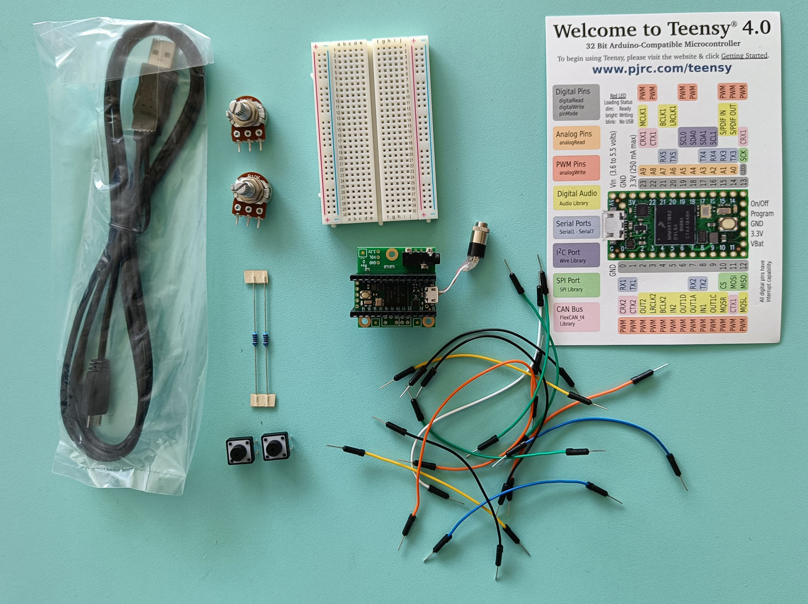

# SON: 3TC Audio Project @ END Lyon

In this course, students program an embedded system (the Teensy 4.0: <https://www.pjrc.com/store/teensy40.html>) for real-time audio signal processing applications. By doing so, they learn the basics of audio software architecture, audio signal processing in C++, and embedded system programming (C++).

The course starts with lectures  on embedded real-time audio signal processing. During this workshop, students are walked through the architecture of a real-time audio DSP system (e.g., audio callback, buffering, sampling, etc.), and learn various basic techniques for audio signal processing (e.g., filters, oscillators, sound synthesis techniques, sound processing techniques, sound analysis techniques, etc.) taking a very practical approach.

After this period, various project ideas are suggested to students. Students work in groups of 2 on projects. The project period culminates in a final presentation taking the form of a 10mn presentation where each group of students can present his project.

## Instructors

* [Romain Michon](http://perso.citi-lab.fr/rmichon/) (Inria)
* [Tanguy Risset](http://perso.citi.insa-lyon.fr/trisset/) (INSA Lyon)

## Resources

* Course GitHub Repository: <https://github.com/inria-emeraude/son-ens>
* Teensy Audio Library: <https://www.pjrc.com/teensy/td_libs_Audio.html>
* The SON kit for a group of two students:

<figcaption>A pair of headphones, one Teensy 4.0 with its companion audio shield, two buttons, two potentiometers, one breadboard, and a couple of resistors and jumper cables (do not loose these components!).
</figcaption>

## Requirements

* Installing Teensyduino as explained in [Lecture 1](lectures/lecture1.md).

## Course Overview

* **Lecture 1: [Course Introduction and Programming Environment Setup](lectures/lecture1.md)**
* **Lecture 2: [Audio Signal Processing Fundamentals](lectures/lecture2.md)** 
* **Lecture 3: [Digital Audio Systems Architectures and Audio Callback](lectures/lecture3.md)** 
* **Lecture 4: [Hardware Control and Audio Codec Configuration](lectures/lecture4.md)**
* **Lecture 5: Introduction to Faust (Yann Orlarey)** 
* **Lecture 6: [Audio Processing Basics I](lectures/lecture6.md)**
* **Embedded 1: [Embedded basics: interrupts](lectures/embedded1.md)** 
* **Embedded 2: [Embedded basics: embedded OS](lectures/embedded2.md)**
* **Lecture 7: [Audio Processing Basics II](lectures/lecture7.md)** 
* **Lecture 8: [Faust on the Teensy and Advanced Control](lectures/lecture8.md)** 
* **Independent work on Projects** 

* **Final Presentations (G1 + G2)** 11/11 2025 and 14/11 2025

